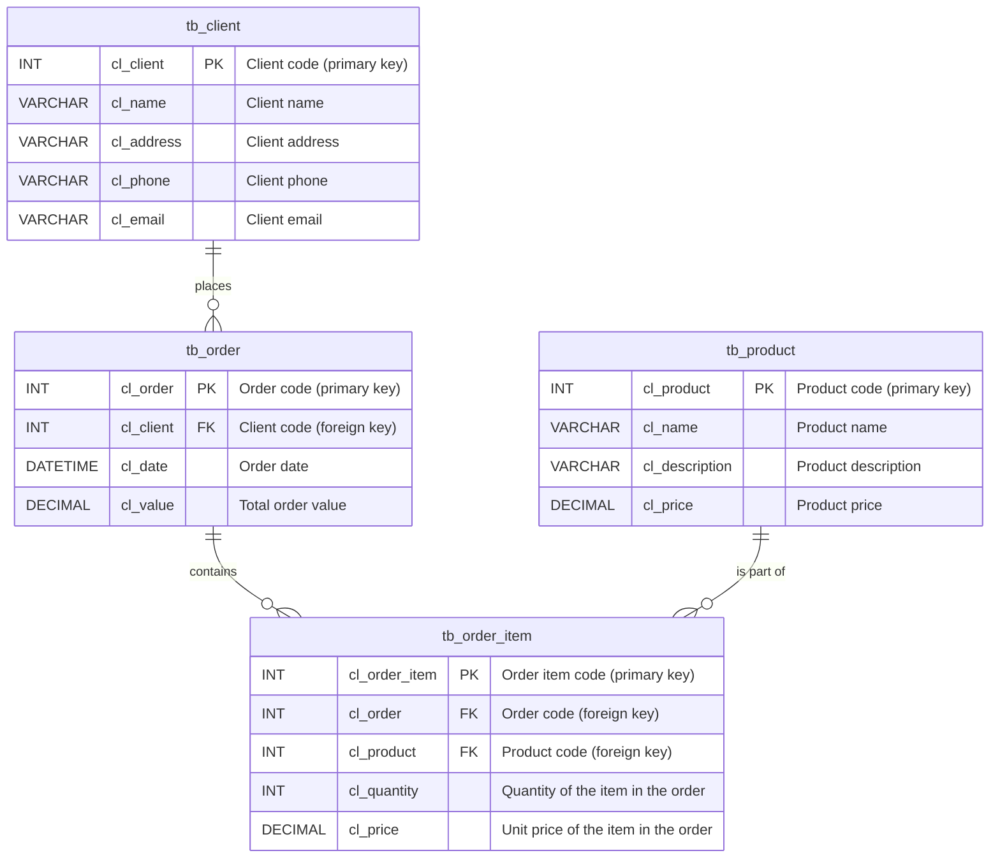

<!-- # [ zrfisaac ] -->

<!-- # [ about ] -->
<!-- # - author : Isaac Caires -->
<!-- # . - email : zrfisaac@gmail.com -->
<!-- # . - site : zrfisaac.github.io -->

<!-- # [ markdown ] -->

#  QuickOrder - Client Order Management System

## UNDER DEVELOPMENT!

**QuickOrder** is a lightweight MVP designed to showcase a streamlined client order management system. It facilitates the management of customers, orders, order items, and products. QuickOrder is ideal for small businesses or developers looking for a simple and efficient system to demonstrate order-related functionalities.

## Features
- **Client Management**: Add, edit, and remove clients from the system.
- **Order Management**: Create, update, and track client orders.
- **Product Catalog**: Manage product information and inventory.
- **Order Items**: Link products to orders with quantity and pricing details.

## Dependencies
This project uses the following tools and libraries:

- **[SQL Server Express](https://www.microsoft.com/en-us/sql-server/sql-server-downloads)**: A lightweight version of SQL Server for database management.
- **[Delphi Community Edition](https://www.embarcadero.com/products/delphi/starter/free-download)**: An IDE for rapid application development.
- **[DevExpress](https://www.devexpress.com/)**: A library for UI components and tools.
- **[FastReport](https://www.fast-report.com/)**: A reporting solution for generating and managing reports.
- **[Fugue Icons 3.5.6](https://p.yusukekamiyamane.com/)**: A collection of high-quality icons created by Yusuke Kamiyamane.

##

## Entity-Relationship Diagram (ERD)

### Explanation:
- **`tb_client`**: Contains client details.
- **`tb_product`**: Stores product information.
- **`tb_order`**: Represents orders and links to clients through a foreign key.
- **`tb_order_item`**: Tracks items in an order and links to both orders and products.

### Relationships:
1. A **client** (`tb_client`) can place multiple **orders** (`tb_order`).
2. An **order** (`tb_order`) can have multiple **

## Upcoming Versions
QuickOrder is under development and will serve as a showcase for simple and efficient order management systems.

## Getting Started
Installation and setup instructions will be available upon release.

## Contribution
Contributions are welcome! To contribute:
1. Fork the repository.
2. Create a new branch (`git checkout -b feature/your-feature`).
3. Commit your changes (`git commit -m 'Add your feature'`).
4. Push to the branch (`git push origin feature/your-feature`).
5. Open a pull request.

## License
[MIT License](LICENSE)
