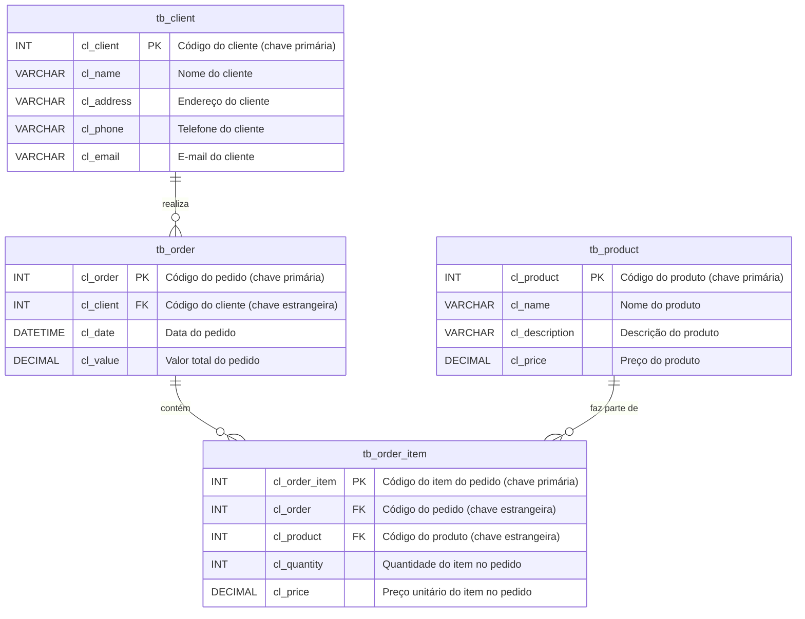

---

#  Quick Order

**QuickOrder** é um MVP leve projetado para demonstrar um sistema simplificado de gerenciamento de pedidos de clientes. Ele facilita o gerenciamento de clientes, pedidos, itens de pedidos e produtos. QuickOrder é ideal para pequenos negócios ou desenvolvedores que buscam um sistema simples e eficiente para demonstrar funcionalidades relacionadas a pedidos.

## Funcionalidades
- **Gerenciamento de Clientes**: Adicione, edite e remova clientes do sistema.
- **Gerenciamento de Pedidos**: Crie, atualize e acompanhe os pedidos de clientes.
- **Catálogo de Produtos**: Gerencie informações e inventário de produtos.
- **Itens do Pedido**: Relacione produtos a pedidos com detalhes de quantidade e preço.

## Dependências
Este projeto utiliza as seguintes ferramentas e bibliotecas:

- **[SQL Server Express](https://www.microsoft.com/en-us/sql-server/sql-server-downloads)**: Uma versão leve do SQL Server para gerenciamento de banco de dados.
- **[Delphi Community Edition](https://www.embarcadero.com/products/delphi/starter/free-download)**: Um IDE para desenvolvimento rápido de aplicações.
- **[DevExpress](https://www.devexpress.com/)**: Uma biblioteca para componentes e ferramentas de interface do usuário.
- **[FastReport](https://www.fast-report.com/)**: Uma solução para geração e gerenciamento de relatórios.
- **[Fugue Icons 3.5.6](https://p.yusukekamiyamane.com/)**: Uma coleção de ícones de alta qualidade criada por Yusuke Kamiyamane.

##

## Diagrama de Entidade-Relacionamento (DER)

### Explicação:
- **`tb_client`**: Contém detalhes dos clientes.
- **`tb_product`**: Armazena informações dos produtos.
- **`tb_order`**: Representa os pedidos e se relaciona com os clientes por meio de uma chave estrangeira.
- **`tb_order_item`**: Acompanha os itens de um pedido e se relaciona tanto com pedidos quanto com produtos.

### Relacionamentos:
1. Um **cliente** (`tb_client`) pode realizar vários **pedidos** (`tb_order`).
2. Um **pedido** (`tb_order`) pode conter vários **itens de pedido** (`tb_order_item`).
3. Um **produto** (`tb_product`) pode fazer parte de vários **itens de pedido** (`tb_order_item`).

## Próximas Versões
QuickOrder está em desenvolvimento e servirá como uma vitrine para sistemas simples e eficientes de gerenciamento de pedidos.

## Como Começar
As instruções de instalação e configuração estarão disponíveis após o lançamento.

## Contribuição
Contribuições são bem-vindas! Para contribuir:
1. Faça um fork do repositório.
2. Crie uma nova branch (`git checkout -b feature/sua-funcionalidade`).
3. Faça o commit das suas alterações (`git commit -m 'Adicione sua funcionalidade'`).
4. Envie para o repositório (`git push origin feature/sua-funcionalidade`).
5. Abra um pull request.

## Licença
[Licença MIT](LICENSE)
